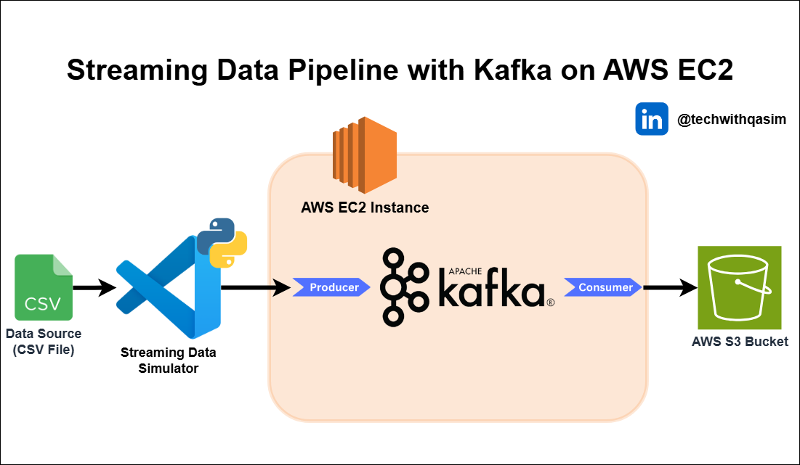

# Streaming Data Pipeline with Kafka on AWS EC2 and S3 | Real-Time Data Integration

This repository provides a comprehensive guide to building a real-time streaming data pipeline using Apache Kafka deployed on AWS EC2, with final data storage in AWS S3. The project simulates data ingestion from a CSV file, streams it into Kafka via a Python-based producer, and utilizes a Kafka consumer to process and upload the data to S3.

### Key Highlights:

- **Architecture Overview:**
 - Data Source: CSV file simulating real-time data streams.
 - Streaming Simulator: Python script that reads from the CSV and sends data to Kafka in small, timed batches.
 - Kafka on EC2: Kafka brokers are deployed on an AWS EC2 instance to handle streaming and message queuing.
 - AWS S3: Consumed data is stored in AWS S3 for long-term retention and analysis.

- **Scalability & Fault Tolerance:**
Kafka’s distributed architecture ensures fault tolerance and scalability, capable of handling large volumes of data across multiple producers and consumers. This pipeline can scale horizontally to meet increasing data demands.

- **Use Cases:**
 - Real-time monitoring of IoT devices.
 - Live user activity tracking.
 - Financial transaction data processing.
 - Log aggregation and analytics.

- **Technologies Used:**
 - Apache Kafka – Real-time message streaming and processing.
 - AWS EC2 – Cloud infrastructure to host Kafka brokers.
 - AWS S3 – Durable, scalable, and cost-effective storage solution.
 - Python – Data simulation and producer/consumer scripts.